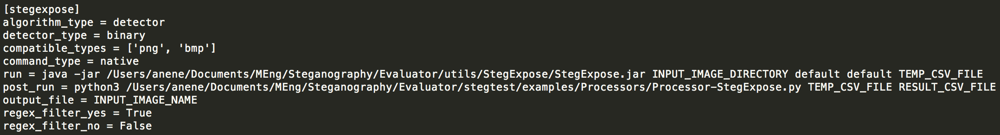

# CONFIGURATION SPECIFICATION

Stegtest works by processing configuration files that contain information about each of the algorithms in the system. This allows StegTest to be a highly interoperable and modular system that can easily integrate into existing steganographic pipelines. Configuration files specify how a specific steganographic or steganalysis tool operates on your machine. You pass in several parameters that determine the following

- <b>Compatibility</b>: The compatibility of the tool for different operating mechanisms
- <b>Command Execution</b>: The commands that must be used to execute the tool. 

## Embeddor Configuration 

### Example #1: Native Command

### Example #2: Docker Command

## Detector Configuration 

### Example #1: Classification Detector

### Example #2: Probablistic Detector

