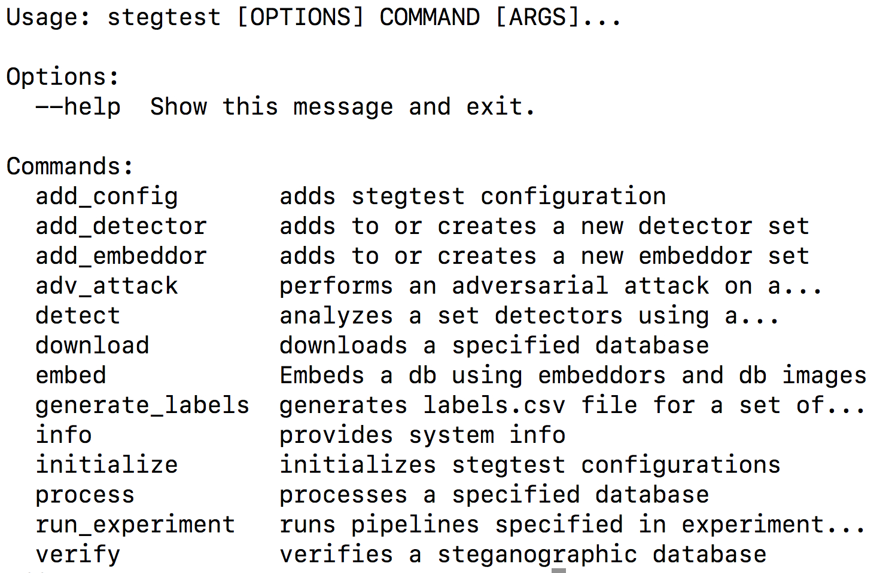

<p align="left">

<i>An open source project from Data to AI Lab at MIT.</i>
</p>

<!-- Uncomment these lines after releasing the package to PyPI for version and downloads badges -->
<!--[](https://pypi.python.org/pypi/stegbench)-->
<!--[](https://pepy.tech/project/stegbench)-->
[](https://travis-ci.org/DAI-Lab/stegbench)
[](https://codecov.io/gh/DAI-Lab/stegbench)

# StegBench

This package allows autotesting of different datasets, steganographers, and steganalyzers. Using this package, extensive and thorough experiments can be carried out efficiently for a number of algorithms. Example configuration files are included as well as sample demo results. For quick-start, please refer to the manual below. 

- Documentation: https://DAI-Lab.github.io/stegbench
- Homepage: https://github.com/DAI-Lab/stegbench

# Overview

StegBench is a steganography orchestration package for the evaluation of both steganaographic and steganalysis methods. The system orchestrates extensive experimentation of steganographic procedures through the use of short, easy-to-use configuration files. 

# Install

## Requirements

**StegBench** has been developed and tested on [Python3.4, 3.5, 3.6 and 3.7](https://www.python.org/downloads/)

Also, although it is not strictly required, the usage of a [virtualenv](https://virtualenv.pypa.io/en/latest/)
is highly recommended in order to avoid interfering with other software installed in the system
in which **StegBench** is run.

These are the minimum commands needed to create a virtualenv using python3.6 for **StegBench**:

```bash
pip install virtualenv
virtualenv -p $(which python3.6) stegbench-venv
```

Afterwards, you have to execute this command to activate the virtualenv:

```bash
source stegbench-venv/bin/activate
```

Remember to execute it every time you start a new console to work on **StegBench**!

<!-- Uncomment this section after releasing the package to PyPI for installation instructions
## Install from PyPI

After creating the virtualenv and activating it, we recommend using
[pip](https://pip.pypa.io/en/stable/) in order to install **StegBench**:

```bash
pip install stegbench
```

This will pull and install the latest stable release from [PyPI](https://pypi.org/).
-->

## Install from source

With your virtualenv activated, you can clone the repository and install it from
source by running `make install` on the `stable` branch:

```bash
git clone git@github.com:DAI-Lab/stegbench.git
cd stegbench
make install
```

## Install for Development

If you want to contribute to the project, a few more steps are required to make the project ready
for development.

Please head to the [Contributing Guide](https://DAI-Lab.github.io/stegbench/contributing.html#get-started)
for more details about this process.

# Quickstart

In this short tutorial we will guide you through a series of steps that will help you
getting started with **StegBench**.

Please proceed to this [TUTORIAL](notebooks/Tutorial.ipynb) to get started with StegBench

# CLI

StegBench also supports a command line interface. To get started, please have stegbench installed in your system and then type in 
```
stegbench --help
```

This will give you a list of the commands. You should get the following output:

.

For each command you can type the command followed by --help to retrieve information specific to that command. 

# Configuration Files

Configuration files provide StegBench with an easy-to-use set of descriptors that define how your steganographic processes operate. Please take a look at some of the example configuration files in the examples/ folder. Each .ini configuration will be labeled by the steganographic procedure's name. This configuration must then follow a restricted specification which only allows for two algorithm types ('detector' | 'embeddor'). 

Each algorithm type will have it's own specific set of specifications as documented in the online manual here: [CONFIGURATION.MD](CONFIGURATION.md).

# What's next?

For more details about **StegBench** and all its possibilities
and features, please check the [documentation site](
https://DAI-Lab.github.io/stegbench/).
